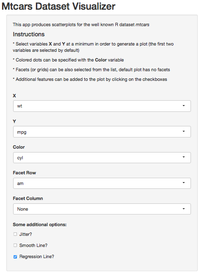

## Features
<br/><br/>
We present  **Mtcars Dataset Visualizer** an easy-to-use tool to visualze your favorite R dataset *mtcars*. This app provides appealing features that will generate tons of different scaterplots with no sweat.

<br/>
In addition, with the implementation of faceting and colouring with respect to dataset variables it is even easier to detect and identify potential patterns in the data. Highlighing the differences and characteristics of the information.

<br/>
Furthermore, the additional options "jitter","smooth line" and "regression line" will allow to observe potential trends in the data.

--- &twocol
## Example (input)
*** {name: left}
<br/><br/><br/><br/>
This part illustrates the usage of the app. We select the following parameters as input of the tool.
*** {name: right}


--- &twocol
## Examples (output)
*** {name: left}
<br/><br/>
In the background the app calls the following R code,

```r
p <- ggplot(mtcars, aes_string(x = "wt", 
    y = "mpg")) + geom_point() + 
    aes_string(color = "cyl") + 
    facet_grid(am ~ .) + 
    geom_smooth(method = "lm", 
        color = "red", 
        size = 2)
```

*** {name: right}
<br/><br/>
which renders the plot

 

--- 
## Final Remarks
<br/><br/><br/>
In conclusion, **Mtcars Dataset Visualizer** provides a flexible yet intuitive tool to display different aspects of the dataset *mtcars*. This allows for a simplified way of performing exploratory data analisis and will save the analysis tons of time to focus on the data modeling and results.

